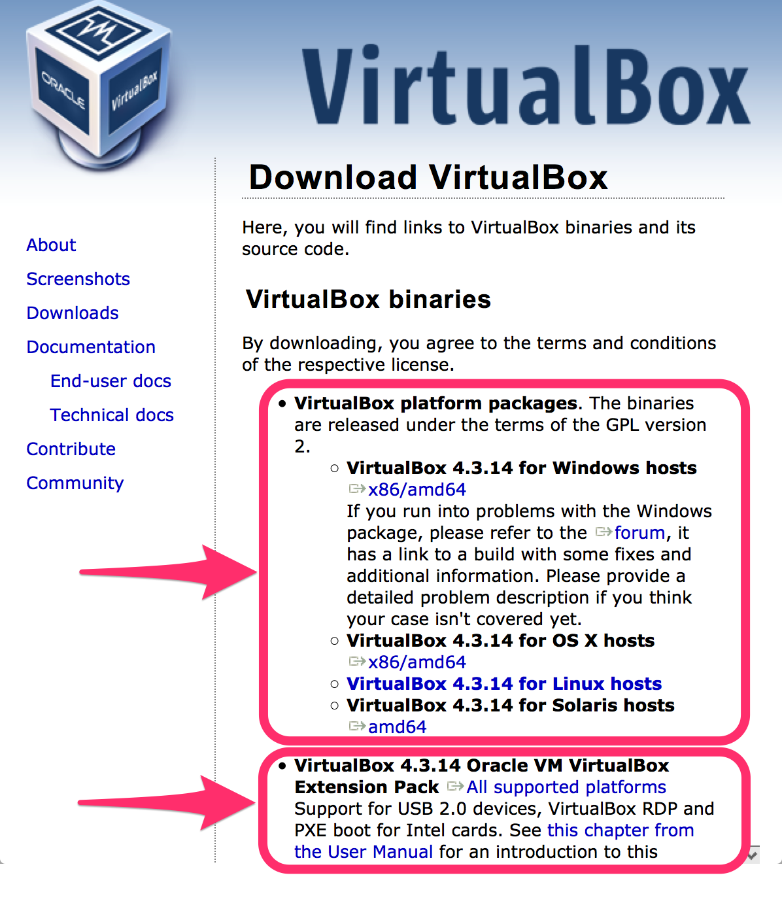
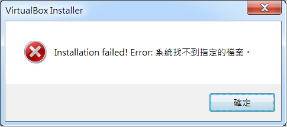

行前準備 Part 1：申請帳號、安裝軟體
===

本課程含大量「實機操作」內容，需請您自備筆記型電腦。請先在您的電腦上，依照以下指示，完成行前準備：

1. 安裝軟體
2. 註冊 GitHub 帳號
3. 註冊 Docker Hub 帳號
4. 列印參考資料
5. 預載範例程式碼


## 1. 安裝軟體

本課程的「實機操作」部分，需要學員自備筆記型電腦。而這些筆電的作業系統，可能是 Windows，也可能是 Mac OS X，或各種 Linux distributions。

為了讓課程有個一致的實作環境，減少干擾施教者與學習者的環境變因，我們統一使用 [Vagrant](http://www.vagrantup.com/) + [VirtualBox](https://www.virtualbox.org/) 虛擬機器組合，作為課堂實作的統一環境。詳細的解說，請見本文附錄：【關於 Vagrant】。這裡先只講軟體安裝步驟。


### 1.1：安裝步驟

為了順利進行本系列文章的操作，請先依照以下步驟安裝 Vagrant 及 VirtualBox：

1. 去 Vagrant 官網的[下載頁](http://www.vagrantup.com/downloads.html)，下載適合的安裝檔，執行之。

2. 去 VirtualBox 官網的[下載頁](https://www.virtualbox.org/wiki/Downloads)，下載兩個安裝檔：

   - VirtualBox platform packages
   - VirtualBox Extension Pack

   並依序執行之。

   


### 1.2：Windows 作業系統注意事項

在 Windows 上安裝 VirtualBox 時，如果遇到以下錯誤：

   

請先切換到放置下載檔案的目錄，找出剛剛下載回來的安裝檔名（以我的例子：`VirtualBox-4.3.14-95030-Win.exe`），再依序執行以下命令：

   ```bat
   $ VirtualBox-4.3.14-95030-Win  -extract
   $ cd VirtualBox
   $ dir
   ```

你應該會看到一個 `msi` 類型的安裝檔，請執行它。

最後，為了運作順暢，你還需要一個「**純命令列**的 ssh 程式」。如果你堅持要用 [PuTTY](http://www.chiark.greenend.org.uk/~sgtatham/putty/)、[PieTTY](http://ntu.csie.org/~piaip/pietty/) 或[可攜版](http://jedi.org/PieTTYPortable/)，可能會在某些進階步驟踩到地雷，建議你安裝一個「**純命令列**的 ssh 程式」吧。以下是一些輕量級的 `ssh.exe` 選項：

  - [OpenSSH for Windows](http://sourceforge.net/projects/opensshwindows/)
  - [Git for the Windows platform](http://git-scm.com/download/win) 裡面含有一枚 `ssh.exe`

安裝後，記得要去【控制台】把 `ssh.exe` 路徑加到 `PATH` 環境變數。

或者，乾脆安裝整套 [MinGW](http://www.mingw.org/) 或 [Cygwin](https://www.cygwin.com/) 算了⋯⋯


## 2. 註冊 GitHub 帳號

本課程會帶你實機操作，將欲「Docker 化」的程式碼置於 [GitHub](https://github.com/) 上，以供後續 Docker Hub 串接運用。

如果你還沒有 GitHub 帳號，請到[這裡](https://github.com/)註冊，並設定好 SSH key。


## 3. 註冊 Docker Hub 帳號

本課程會帶你實機操作，如何利用 Docker 官方的 [Docker Hub](https://registry.hub.docker.com/) 服務，串接置於 GitHub 的程式碼，自動建置 Docker image。

如果你還沒有 Docker Hub 帳號，請到[這裡](https://hub.docker.com/account/signup/)註冊。


## 4. 列印參考資料

有幾份資料，在課堂上會反覆用到。因著作權所限，我們無法主動提供紙本。如果您習慣在紙本上註記，請於參加課程之前自行列印，攜至課堂上。

  - [Docker 命令查詢](http://philipzheng.gitbooks.io/docker_practice/content/appendix_command/README.html)

  - [一張圖總結 Docker 的命令](http://philipzheng.gitbooks.io/docker_practice/content/_images/cmd_logic.png) ← 彩色

  - [Dockerfile 指令](http://philipzheng.gitbooks.io/docker_practice/content/dockerfile/instructions.html)


## 5. 預載範例程式碼

請閱讀文件 ☛  [行前準備：預載範例程式碼](config.md)。

為了節省課程現場下載程式及相關資源的時間及頻寬，請學員先在網路暢通的地方，根據指示備妥必要的軟體及設定。


## 附錄：關於 Vagrant

許多 Docker 入門教程會建議 Windows 或 Mac 用戶安裝 [boot2docker](http://boot2docker.io/)。但基於以下理由，本課程不採用這種方案：

  - boot2docker 會在你的電腦上安裝一台 [Tiny Core Linux](http://tinycorelinux.net/) 虛擬機，優點是輕薄短小，但缺點是，與實務常見的 Linux 生態嚴重脫節（實務上，哪些 server 會用 Tiny Core Linux？）。DevOps 觀念告訴我們，Dev 和 Ops 的環境愈接近，愈有利及早發現問題。

  - boot2docker 無法輕易做出獨立、可重複再現的組態，遑論多台主機的 cluster 實驗環境。

相較之下，Vagrant 方案則有下列好處：

  - 可直接在本機端模擬出伺服主機所採用的作業系統及組態，符合 DevOps 的最佳實務。

  - 可輕易做出獨立、可重複再現的多台主機 cluster 實驗環境，更可儲存組態快照 (snapshot)，不怕玩壞系統，可快速還原回原始設定。

  - 反正都要學一點新的東西，與其學習 boot2docker 獨有指令，不如學習用途更廣的 Vagrant。

如果你還不熟悉 Vagrant + VirtualBox 軟體組合，請先閱讀講師在 [CodeData](http://www.codedata.com.tw/) 連載的〈[Vagrant Tutorial](http://www.codedata.com.tw/social-coding/vagrant-tutorial-1-developer-and-vm)〉系列文章，尤其是第二篇：〈[跟著流浪漢把玩虛擬機](http://www.codedata.com.tw/social-coding/vagrant-tutorial-2-playing-vm-with-vagrant)〉，**至少這篇要照著做過一遍！**才能確定你已經成功安裝好 Virtualbox + Vagrant (+ ssh)，才能進行實機操作課程。

課堂上，也會帶領大家操作一些常用的 Vagrant 指令。
