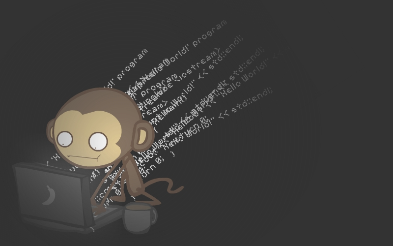
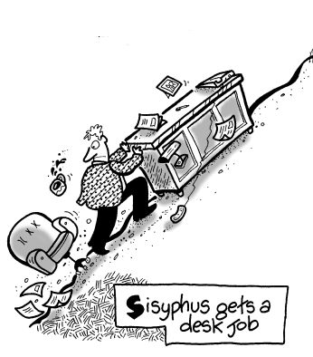
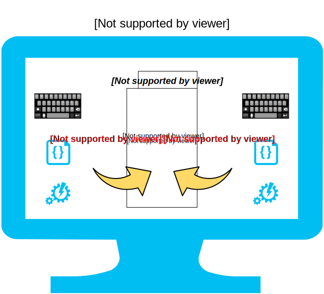

name: inverse
layout: true
class: center, middle, inverse

---

.percent80[.center[]]

# 舉一反三／第二個 Docker Image

???

Img src: http://zikayn.com/blog/wp-content/uploads/2011/12/monkey-5.jpg

---

layout: false

# Lab setup

--

.pull-left[
## VMs

1. `centos`:
   - `up`
   - `ssh`

2. `main`:
   - `up`
   - `ssh`

3. `registry`:
   - `up`
]

--

.pull-right[
## Lab directory
- `build-redis-el5`
]

---

class: center, middle

# 在嘗試 build Docker image 之前，先確定自己會 build！

--

## Vagrant 是你的好朋友...

--

### ☛ 先在 Vagrant 實驗
(`chef/centos-5.11`, `chef/centos-6.5`, ...)

--

### ☛ ... 再轉移經驗到 Docker 上

---

class: center, middle

# 還沒 Docker 之前，<br/>我們是怎麼 build 的？

---

.percent70[.center[]]


---

# RPM file for Redis server

What's inside?

```bash
$ rpm -qpl redis-2.8.19-1.el5.remi.x86_64.rpm
```

.footnote[.red[*] See `README.md` file for more info.]

--

Extract it to local directory `./tmp`, if you like

```bash
$ mkdir tmp
$ cd tmp

$ rpm2cpio ../redis-2.8.19-1.el5.remi.x86_64.rpm | cpio -div

$ ls -al
```

---

# Install RPM file for Redis server

Install!

```bash
$ rpm -i redis-2.8.19-1.el5.remi.x86_64.rpm
```

--
...ouch!

```bash
警告：redis-2.8.19-1.el5.remi.x86_64.rpm: 表頭 V3 DSA 簽名：NOKEY, key ID 00f97f56
錯誤：相依性偵測失敗：
  libjemalloc.so.1()(64bit) 被 redis-2.8.19-1.el5.remi.x86_64 所需要
```

... What happened?

---

class: center, middle

# Dependency

.percent120[.center[]]

---

# Install RPM and all dependencies...

Install dependencies, in correct order!

```bash
$ rpm -i jemalloc-3.6.0-2.el5.x86_64.rpm

$ rpm -i redis-2.8.19-1.el5.remi.x86_64.rpm
```

--

.footnote[.red[*] OS-level package management mechanisms (such as YUM) will handle these dependencies automatically for you.]

---

# What's inside the dependent package?

```bash
# list
$ rpm -qpl jemalloc-3.6.0-2.el5.x86_64.rpm

# extract contents, if you're curious...
$ rpm2cpio ../jemalloc-3.6.0-2.el5.x86_64.rpm    | cpio -div
```

.footnote[.red[*] 預告："[DLL Hell](http://en.wikipedia.org/wiki/DLL_Hell)" 或更廣義的 "[dependency hell](http://en.wikipedia.org/wiki/DLL_Hell)" 問題。 ]

---

class: center, middle

# 那麼，Docker 是怎麼 build 的？

---

.percent110[.center[]]

---

class: center, middle

# Dockerfile

## "Makefile" for Docker images


---

# Dockerfile for Redis server

```dockerfile
# a naive Redis image

FROM  centos:5.11

# copy to image/container
COPY  redis-2.8.19-1.el5.remi.x86_64.rpm  redis-server.rpm
COPY  jemalloc-3.6.0-2.el5.x86_64.rpm     jemalloc.rpm

# install from RPM
RUN  rpm -i jemalloc.rpm redis-server.rpm

# start Redis server
CMD  [ "redis-server" ]
```

.footnote[.red[☛] Open 〈[Dockerfile 指令](http://philipzheng.gitbooks.io/docker_practice/content/dockerfile/instructions.html)〉 and "[Dockerfile Reference](https://docs.docker.com/reference/builder/)" side by side for your easy reference.]

---

# 逐行拆解 Dockerfile 指令

[略]

---

# Build it!

```bash
$ docker build .
```

.percent50[.right[]]


.footnote[.red[*] See the _very very very ugly_ ID?]


---

# Look what we've built...


```bash
$ docker images
```

.footnote[.red[*] See the _very very very ugly_ ID?]

Or,

```bash
$ docker images --tree
```

---

# 收割時刻：Run it!

- Foreground mode:

  ```bash
  $ docker run  `THE_UGLY_IMAGE_ID`
  ```

- Background mode (_**d**aemon_ mode):

  ```bash
  $ docker run -d  `THE_UGLY_IMAGE_ID`
  ```

- Container status:

  ```bash
  # current status
  $ docker ps
  ```

---

# "SSH into" containers without SSH

Inject a new process into the "running container".

--

For examples,

- `cat` the container's content:

  ```bash
  $ docker exec  `CONTAINER_NAME`  \
        cat /etc/redhat-release
  ```

--
- `bash` with an **<u>i</u>**nteractive **<u>t</u>**ty:

  ```bash
  $ docker exec -it  `CONTAINER_NAME`  \
        bash
  ```

---

# Quiz

Dig into a running Redis container.

See if RPM files are installed into the container successfully.

---

template: inverse

# Dependency Hell

---

class: center, middle

.percent60[.center[]]


---

class: center, middle

.percent90[.center[]]


---

# Dependency hell... Where?

```bash
# list
$ rpm -qpl jemalloc-3.6.0-2.el5.x86_64.rpm


# extract contents, if you're curious...
$ rpm2cpio ../jemalloc-3.6.0-2.el5.x86_64.rpm  |  cpio -div
./usr/bin/jemalloc.sh
./usr/lib64/libjemalloc.so.1       ◀◀◀◀◀◀◀◀ 就是這個！
./usr/share/doc/jemalloc-3.6.0
./usr/share/doc/jemalloc-3.6.0/COPYING
./usr/share/doc/jemalloc-3.6.0/README
./usr/share/doc/jemalloc-3.6.0/VERSION
./usr/share/doc/jemalloc-3.6.0/jemalloc.html
609 blocks
```


---

class: center, middle

.percent90[.center[]]

---

template: inverse

# The Docker Way

### 『籃板之下就是戰場！』
### 『無論如何都一定要死守自己的陣地！』


---

class: center, middle


.percent120[.center[]]


---

# Isolation


## ☛ at image level

```bash
$ ls -al /var/lib/docker/graph
```

--

## ☛ at container level

```bash
# on-disk structure
$ ls -al /var/lib/docker/containers

# runtime view
$ docker exec -it  CONTAINER_NAME  bash
```

--

## ☛ at runtime, "**.red[cgroup]**" and "**.red[namespace]**" mechanisms of Linux kernel are also used.

---

template: inverse

# Recap: Docker 兩項特點

## Dependency
## Isolation

---

class: center, middle

# Questions?
