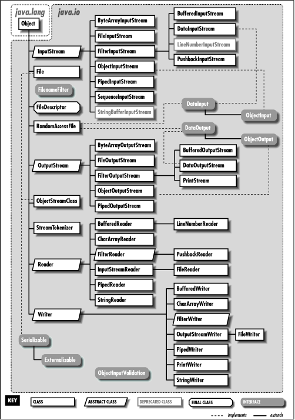

name: inverse
layout: true
class: center, middle, inverse

---

.percent90[.center[]]

# 牛刀小試／第一個 Docker Image

???

Img src: http://www.vectorstock.com/royalty-free-vector/cook-vector-684665

---

layout: false

# Lab setup

--

.pull-left[
## VMs

1. `main`:
   - `up`
   - `ssh`

2. `registry`:
   - `up`
]

--

.pull-right[
## Lab directory
- `build-redis`
]

---

template: inverse

# Layers

## Which base image to build from?

---

# Analogy: base class (super class)

.percent50[.center[]]

???

Img src: http://doc.sumy.ua/prog/java/exp/ch10_01.htm

---

# Docker base image

--

- Minimalism: based on `scratch` or `busybox`

  - [Create the smallest possible Docker container](http://blog.xebia.com/2014/07/04/create-the-smallest-possible-docker-container/)
  - [Squashing Docker Images](http://jasonwilder.com/blog/2014/08/19/squashing-docker-images/)
  - [Creating minimal Docker images from dynamically linked ELF binaries](http://blog.oddbit.com/2015/02/05/creating-minimal-docker-images/)
  - [Creating super small docker images](http://yasermartinez.com/blog/posts/creating-super-small-docker-images.html)

--

- Modest: barebone Linux distributions
  - Reuse your existing experiences: make, ant, apt-get, yum...

--

- Convenience: programming languages installed
  - Reuse your existing experiences: gem, maven, npm, pip...

---

class: middle

# .center[Let's start by this approach...]

<br/>
- Modest: barebone Linux distributions
  - Reuse your existing experiences: make, ant, apt-get, yum...

---

class: center, middle

# 在嘗試 build Docker image 之前，先確定自己會 build 傳統軟體！

--

## Vagrant 是你的好朋友...

--

### ☛ 先在 Vagrant 實驗
(`ubuntu/trusty64`, `chef/debian-7.6`, ...)

--

### ☛ ... 再轉移經驗到 Docker 上

---

class: center, middle

# 還沒 Docker 之前，<br/>我們是怎麼 build 的？

---

.percent70[.center[]]

---

# Add something to root file system (rootfs)

<br/>

.pull-left[
  .percent90[.center[]]
]

.pull-right[
  .percent90[.center[]]
]


???

Img src: http://www.vectorstock.com/royalty-free-vector/cook-vector-684665


---

# DEB file for Redis server

What's inside?

```bash
$ dpkg -c redis-server_2.8.19.deb
```

.footnote[.red[*] See `README.md` file for more info.]

--

Extract it to local directory `./tmp`, if you like

```bash
$ mkdir tmp

$ dpkg -x redis-server_2.8.19.deb  tmp

$ ls -al tmp
```

---

# Install DEB file for Redis server

Install!

```bash
$ sudo dpkg -i redis-server_2.8.19.deb
```

---

class: center, middle

# 那麼，Docker 是怎麼 build 的？

--

.percent90[.center[]]

Add something to ...?

---

# Add something to ~~rootfs~~ <br/> base image!

.percent110[.center[]]

---

class: center, middle

Add something to *layered* base image!

.percent70[.center[]]

---

class: center, middle

# Dockerfile

## "Makefile" for Docker images


---

# Dockerfile for Redis server

```dockerfile
# a naive Redis image

FROM ubuntu:14.04

# copy to image/container
COPY redis-server_2.8.19.deb redis-server.deb

# install from deb
RUN dpkg -i redis-server.deb

# start Redis server
CMD [ "redis-server" ]
```

.footnote[.red[☛] Open 〈[Dockerfile 指令](http://philipzheng.gitbooks.io/docker_practice/content/dockerfile/instructions.html)〉 and "[Dockerfile Reference](https://docs.docker.com/reference/builder/)" side by side for your easy reference.]

---

# 逐行拆解 Dockerfile 指令

## #1: Base image

```dockerfile
FROM  ubuntu:14.04
```

--

Remember image hierarchy?

```bash
$ docker images --tree
```

---

# 逐行拆解 Dockerfile 指令

## #2: Add something to ~~rootfs~~ target image

```dockerfile
COPY  redis-server_2.8.19.deb  redis-server.deb
```

.percent50[.center[]]


???

Img src: http://www.vectorstock.com/royalty-free-vector/cook-vector-684665

---

# 逐行拆解 Dockerfile 指令

## #3: Run commands within ~~rootfs~~ target image

```dockerfile
# install from deb
RUN  dpkg  -i  redis-server.deb
```

---

# 逐行拆解 Dockerfile 指令

## #4: Default start cmd for the target image

```dockerfile
# start Redis server
CMD  [ "redis-server" ]
```

.footnote[.red[*] In this case, `/usr/bin/redis-server` <br/> as installed from the DEB file.]

---

# Build it!

```bash
$ docker build .
```

.percent50[.right[]]


.footnote[.red[*] See the _very very very ugly_ ID?]


---

# Look at what we've built...


```bash
$ docker images
```

.footnote[.red[*] See the _very very very ugly_ ID?]

--

Or,

```bash
$ docker images --tree
```

---

# 收割時刻：Run it!

Foreground mode:

```bash
$ docker run  `THE_UGLY_IMAGE_ID`
```

--

**Ctrl-C** to stop.

--

Container status:

```bash
# current status
$ docker ps

# historical status
$ docker ps -a
```


---

# 收割時刻：Run it!

Background (_**d**aemon_ or _**d**etached_) mode:

```bash
$ docker run -d  `THE_UGLY_IMAGE_ID`
```

.footnote[.red[*] See yet another _very very very ugly_ ID?]

--

Container status:

```bash
# current status
$ docker ps
```


---

# Image IDs and Container IDs


<br/>

>| Static Structure | ↔ | Dynamic Behavior |
|:----------------:|---|:----------------:|
|  image 映像檔     | ↔ |  container 容器   |


--

.pull-left[
- images:

   ```bash
   $ docker images
   ```
]

.pull-right[
- containers:

   ```bash
   $ docker ps
   ```
]


---

# Stop & Remove

>| Static Structure | ↔ | Dynamic Behavior |
|:----------------:|---|:----------------:|
|  image 映像檔     | ↔ |  container 容器   |


--

.pull-right[
- containers:

   ```bash
   $ # stop it
   $ docker stop  \
         `THE_UGLY_CONTAINER_ID`

   $ # remove it altogether
   $ docker rm  \
         `THE_UGLY_CONTAINER_ID`
   ```
]

--

.pull-left[
- images:

   ```bash
   $ docker rmi  \
         `THE_UGLY_IMAGE_ID`
   ```
]

---

template: inverse

#Naming

.center[]

.right[Source: http://martinfowler.com/bliki/TwoHardThings.html]

---

# Image naming

- Method 1: name it *after* building:

  ```bash
  $ docker tag  `THE_UGLY_IMAGE_ID`  `IMAGE_NAME`
  ```

--
  ... also tag it:

  ```bash
  $ docker tag  `THE_UGLY_IMAGE_ID`  `IMAGE_NAME`:`TAG`
  ```


--

- Method 2: name it *while* building:

  ```bash
  $ docker build  -t `IMAGE_NAME`  .
  ```

--
  ... also tag it:

  ```bash
  $ docker build  -t `IMAGE_NAME`:`TAG`  .
  ```

---

# Container naming

The only method: name it *while* invoking:

- Foreground mode:

  ```bash
  $ docker run  \
        --name `CONTAINER_NAME` \
        `IMAGE_ID_or_NAME`
  ```

--

- Daemon mode:

  ```bash
  $ docker run -d  \
        --name `CONTAINER_NAME` \
        `IMAGE_ID_or_NAME`
  ```

---

template: inverse

# Process Injection

.footnote[.red[*] Useful for diagnosis. ]

---

# "SSH into" containers without SSH

Inject a new process into the "running container".

--

For examples,

- `cat` the container's content:

  ```bash
  $ docker exec  `CONTAINER_NAME`  \
        cat /etc/os-release
  ```

--
- `bash` with an **<u>i</u>**nteractive **<u>t</u>**ty:

  ```bash
  $ docker exec -it  `CONTAINER_NAME`  \
        bash
  ```

---

# Quiz

Dig into a running Redis container.

See if DEB files are installed into the container successfully.

---

class: center, middle

# Questions?
